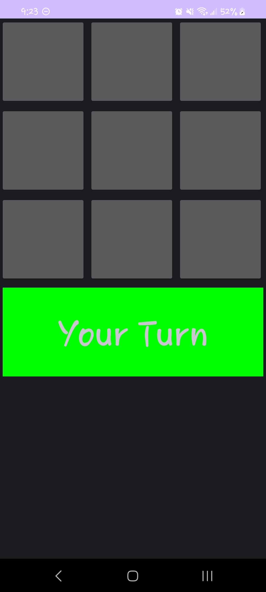
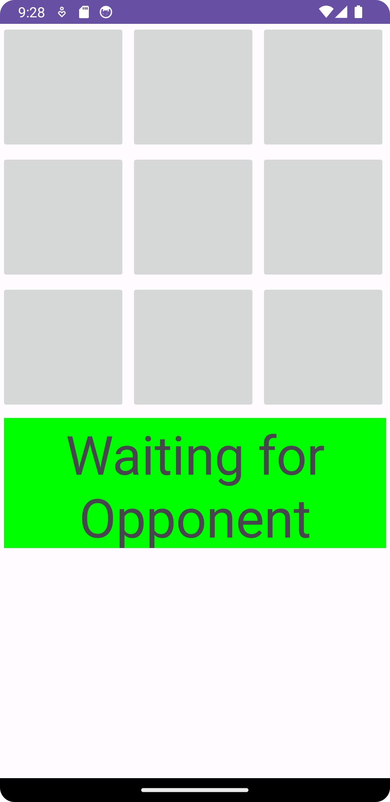
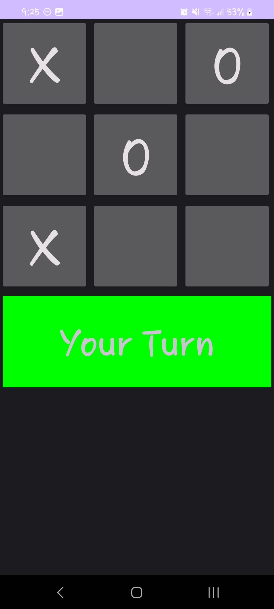
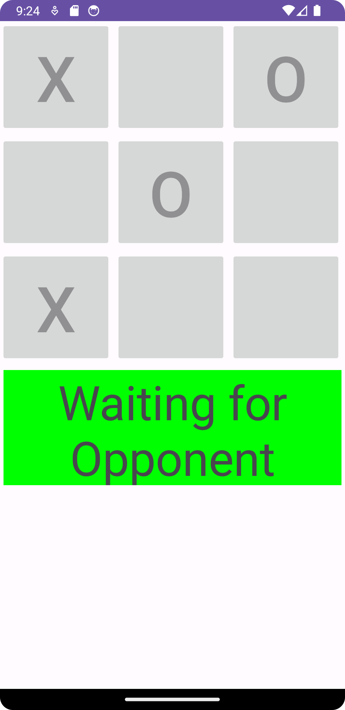
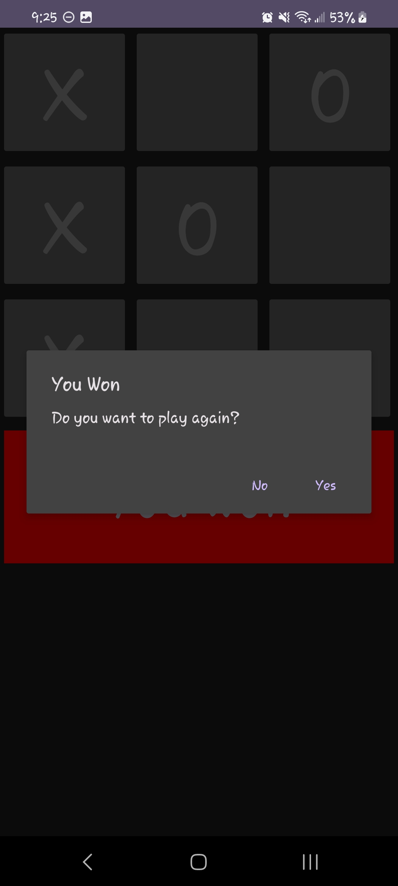
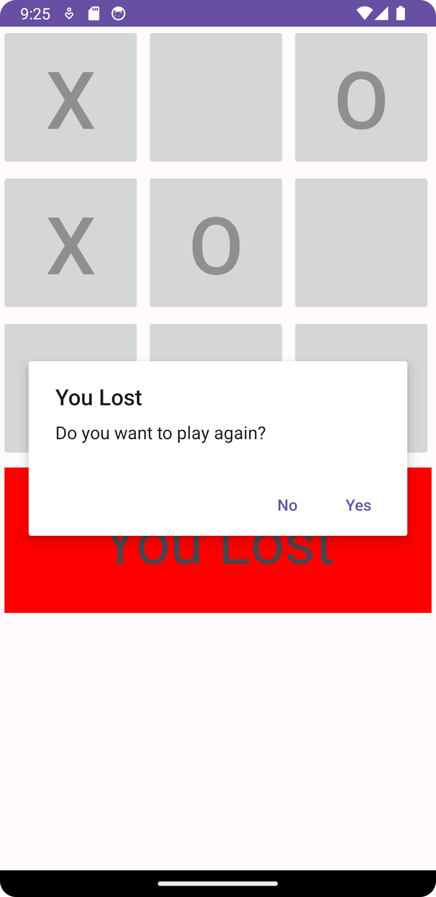
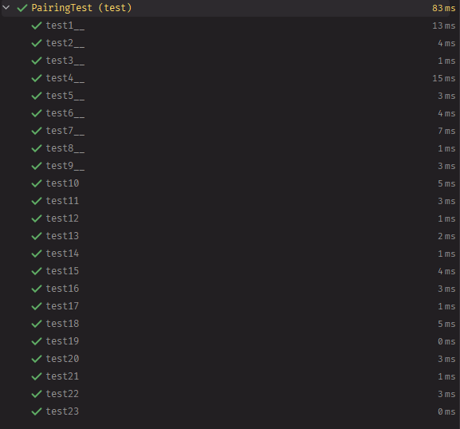

# Tic-Tac-Toe Server

Cary Keesler, Tyler Cady, and Ernesto Sola-Thomas

## Milestone 1

Git Practice: [Repo](https://github.com/esola-thomas/Intro_to_Git)

During this milestone we created outlines of the classes that we are going to be using in later milestones. The
classes `Event`, `User`, `ServerHandler`, `SocketServer`, `GamingResponse`, `Request`, and `Response` were created in
three different packages: `model`, `server`, and `socket`. Along with all of these classes we needed to create tests to
make sure that the classes' functionality works as intended. We also added comments for the classes and their respective
methods so that we could create Javadoc documentation for the project.

### Question 1:

In your test class `SocketServerTest`, what happens if you provide a negative value for a port number? (Remember port
numbers are always positive) How do you think you can fix these issues?

#### Answer 1:

It will throw an `IllegalArgumentException` at runtime. To fix the issue add input validation to verify the value is
between (1-65535) valid port number range.

### Question 2:

In your `ServerHandler` class, what happens if you do not override the `run()` function? Is there an error? Why?

#### Answer 2:

There would be an error if run wasn't overridden. Since `ServerHandler` extends `Thread` and `Thread` has a
method `run`, if you were to call `run` on a `ServerHandler` instance, without overriding, it would use the
implementation provided by `Thread` and would not produce the expected outcome.z

## Milestone 2

TicTacToe Server: [Repo](https://github.com/carykees98/Tic-Tac-Toe_Server)

In this milestone, we implemented networking between two clients and a server. One client send a move to the server
while the other one sends requests for move updates. This allows each client to send moves when they are made and for
the other client to receive them within a reasonable period of time. We had to make the server multithreaded so that it
could handle requests from multiple clients simultaneously.

### Question 1:

Do you have a working System that allows two players to play TicTacToe once? If Yes, support your answer with
screenshots of the gameplay at the beginning, mid-game, and game over. If No, explain your progress and challenges.

#### Answer 1:

##### Beginning

##### Mid

##### End

### Question 2:

Explain how the game uses the attribute turn and player of the `TicTacToe` class to manage the game state between the
two distributed game boards. Can we still achieve the same thing without introducing `player` attributes in this
milestone? Why?

#### Answer 2:

The `TicTacToe` class uses the `turn` attribute to keep track of which player's turn it is while playing the game.
The `play` method updates game state by marking current player's symbol (1 or 2) and toggles `turn`. If the `play`
method were removed it would become very difficult to keep track of the game's state and as such, yeah, without it there
is no way to know if the buttons should be enabled or disabled to allow or keep a player from making a move

### Question 3:

The server currently deletes or resets the game move once it sends a `GamingResponse` to the client. Is this necessary?
What are the pros and cons?

#### Answer 3:

By deleting and resetting the game move once it sends a `GamingResponse` to the client the game gets a few benefits:
firstly, by deleting the move in the response you ensure that the response is the most accurate and up-to-date state;
second, there is a security benefit by deleting data it prevents clients from manipulating game state on their end.
Cons include a lack of game history as players can't see previous moves or games. Because TicTacToe is a solved game
this isn't major. However, if this were a game like go or chess it may be beneficial to see game history to improve
play. Second, another con is that you can't easily add features like undo.

### Question 4:

The `ButtonHandler` inner class in `MainActivity` currently loops through all 9 buttons to know which button is clicked.
Can you think of a way to not loop through all the buttons? You can implement it to support your explanation, but it is
not compulsory.

#### Answer 4:

Yes. It is possible to not loop through all the buttons. This could be achieved using a modified `ButtonHandler` that
uses `setTag` and `getTag` methods from android's view class. In this case `setTag` could be used to give every button a
unique tag in the format `row:col` where row and col are the positions of the button. `getTag` could then be used to
retrieve the tag that matches the button in the `onClick` method.

## Milestone 2

In this milestone we implemented the connection to the database that we are going to be using. We changed our existing
code in a variety of locations to make it interface with the database and also wrote tests to make sure that the
connection to the database and the sending of events is working as intended.

### Question 1:

Show output for each test case after running `PairingTest`. If you are not getting an expected output, explain your
challenges in each test case.

#### Answer 1:

### Question 2:

What is the difference between `COMPLETE_GAME` and `ABORT_GAME` requests?

#### Answer 2:

`COMPLETE_GAME` indicates that the game was completed properly. `ABORT_GAME` indicates that the game was improperly
completed or that a game invitation was rejected.

### Question 3:

With the current implementation, can two users login to the system using the same account credentials? Why or Why not?

#### Answer 3:

Currently, two users with the same credentials can log in to the system. This is because the players online status is
not checked in handleLogin before logging the user in.

### Question 4:

Explain the stages of `EventStatus` and object `Event` class goes through in the game process. Use the *“The Flow of
Game `Event`”* diagram above as a guide.

#### Answer 4:

Player one sends an invitation to player 2. Player two can either accept it or decline it. In the case of a declined
invitation, the game is aborted. If the invitation is accepted, then you proceed to the playing state. From there you
can go to one of two states, a completed game or and aborted one. If the game is aborted then the players move on to a
new game. If the game is completed then they do the same but the game will be complete.

### Question 5:

In Part 2 - Task 3, the code snippet given to you clears the database before starting the server. Is it necessary? What
happens to your test if that line is removed?

#### Answer 5:

That line is necessary. If that line is removed, the register tests would no longer function as intended because the
user would already exist.
